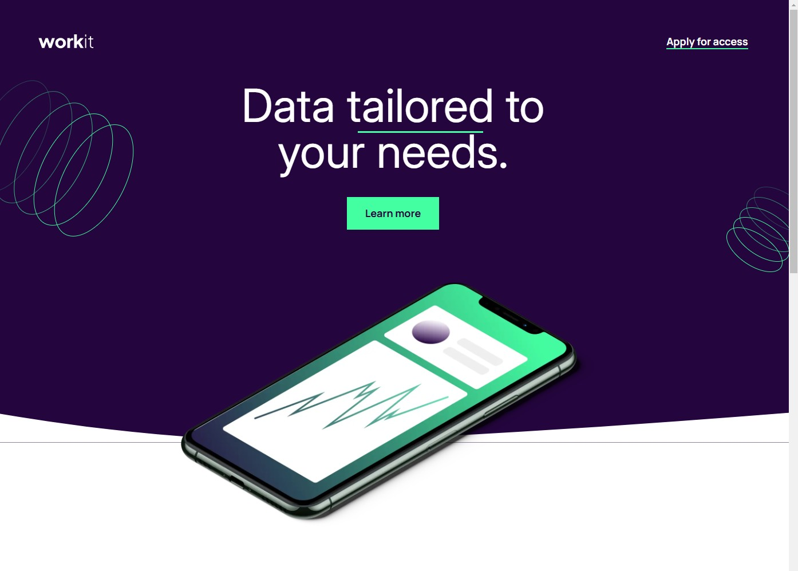
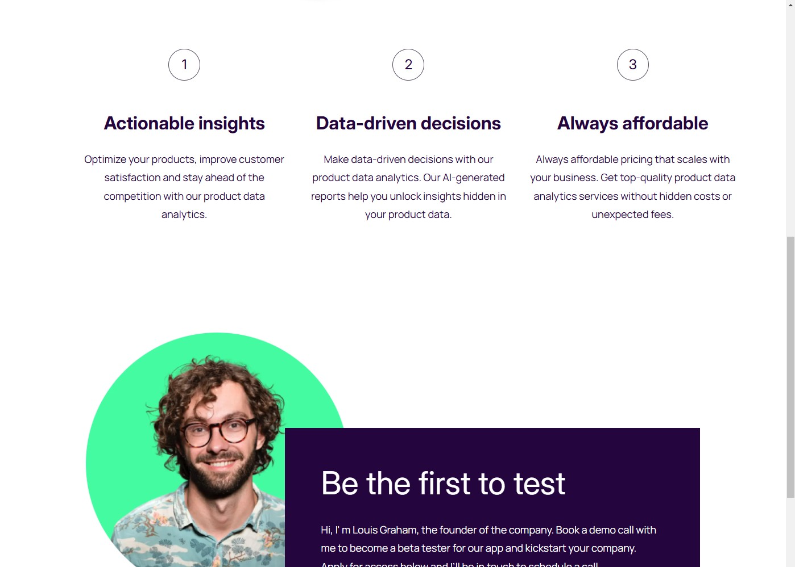
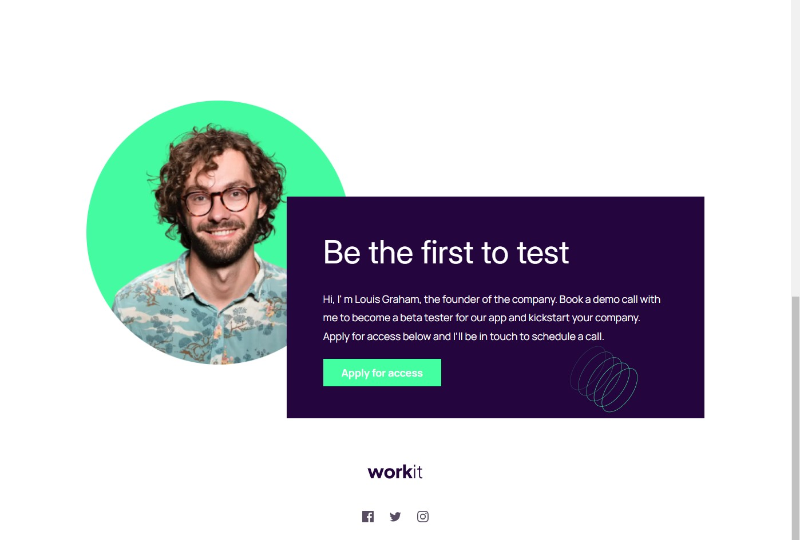

# Frontend Mentor - Workit landing page solution

This is a solution to the [Workit landing page challenge on Frontend Mentor](https://www.frontendmentor.io/challenges/workit-landing-page-2fYnyle5lu). Frontend Mentor challenges help you improve your coding skills by building realistic projects.

## Table of contents

- [Overview](#overview)
  - [The challenge](#the-challenge)
  - [Screenshot](#screenshot)
  - [Links](#links)
- [My process](#my-process)
  - [Built with](#built-with)
  - [What I learned](#what-i-learned)
  - [Continued development](#continued-development)
  - [Useful resources](#useful-resources)
- [Author](#author)

## Overview

### The challenge

Users should be able to:

- View the optimal layout for the interface depending on their device's screen size
- See hover and focus states for all interactive elements on the page

### Screenshot

### Links

- Solution URL: [https://github.com/yossybio/WorkitLandingPage](https://github.com/yossybio/WorkitLandingPage)
- Live Site URL: [https://yermian-workitlandingpage.netlify.app/](https://yermian-workitlandingpage.netlify.app/)

## My process

### Built with

- Semantic HTML5 markup
- CSS custom properties
- Flexbox
- CSS Grid
- [React](https://reactjs.org/) - JS library

### What I learned

This project has been a great experience and an excellent opportunity to practice what I learned in the HTML & CSS course on Udemy.
It was a great exercise in working with Flexbox and CSS Grid, reinforcing my understanding of modern layout techniques.

Additionally, I explored and learned how to work with the Layers feature in Lunacy, which helped improve my design workflow.

### Continued development

I will continue developing and practicing what I’ve learned. Additionally, I plan to improve the Tic-Tac-Toe game I previously built and work on a more comprehensive project utilizing HTML, CSS, JavaScript, and React.js.

### Useful resources

- [Build Responsive Real-World Websites with HTML and CSS](https://www.udemy.com/course/design-and-develop-a-killer-website-with-html5-and-css3/?couponCode=LETSLEARNNOWPP) - This course teached me what is Flexbox, CSS Grid and how to use it right.
- [React - The Complete Guide 2024 (incl. React Router & Redux)](https://www.udemy.com/course/react-the-complete-guide-incl-redux/?couponCode=LETSLEARNNOWPP) - This course teached me React.js and how to use it correctly.

## Author

- Website - [Yossy Yermian](https://yossybio.github.io/cv/)
- Frontend Mentor - [@yossybio](https://www.frontendmentor.io/profile/yossybio)
